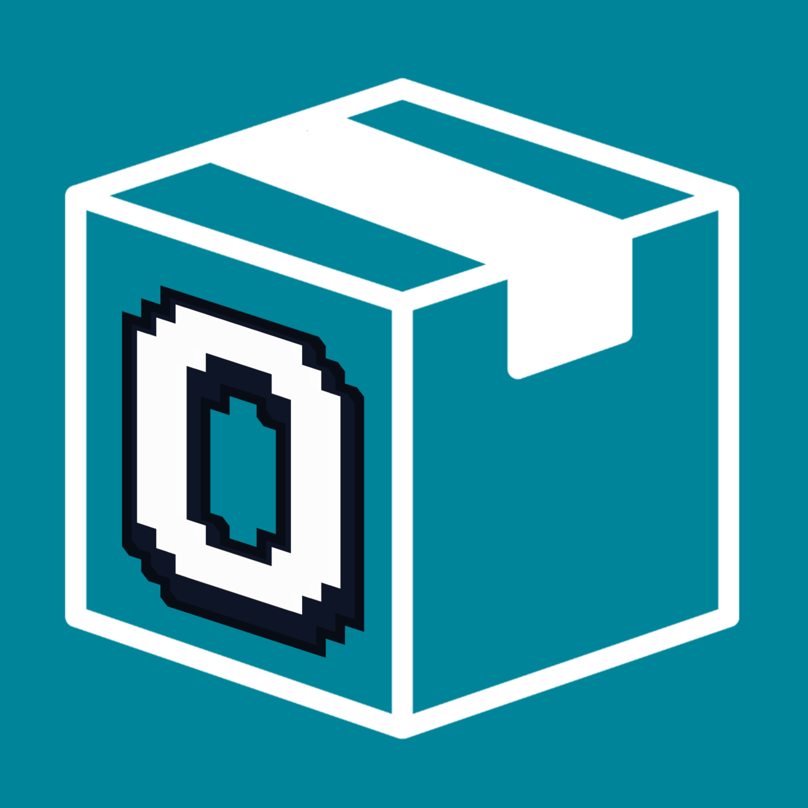

# observal-insight-god

> **Private fork** of [BlazeUp-AI/Observal](https://github.com/BlazeUp-AI/Observal) with the Insights V2 + Session Reconciliation system. This branch is ahead of the public repo.

## What's different from main Observal

This fork adds:

1. **Full session reconciliation** — CLI stop hook and `observal reconcile` command parse local Claude Code JSONL files and send ALL content (assistant text, thinking/CoT, user prompts, tool_use inputs) to the server for storage alongside hook telemetry.
2. **Agent Insights V2** — multi-model LLM report generation (Opus for sections, Sonnet for synthesis, Haiku for facet extraction) that produces periodic performance reports per agent.
3. **Subagent attribution** — reconcile tracks subagent sessions with parent linkage and agent type metadata.
4. **Anti-gaming, dedup, and cross-user services** (in `observal-server/services/`)

## Setup (differences from main repo)

### New environment variables

Add these to your `.env` file (all optional, have defaults):

```bash
# ── Insight Report Generation (requires at least one model configured) ──
# Multi-model setup for cost optimization. Falls back to EVAL_MODEL_NAME if blank.
INSIGHT_MODEL_SECTIONS=     # Opus — detailed narrative sections
INSIGHT_MODEL_SYNTHESIS=    # Sonnet — aggregation/synthesis
INSIGHT_MODEL_FACETS=       # Haiku — per-session facet extraction

# Batch processing controls
INSIGHT_BATCH_ENABLED=true          # Enable/disable periodic report generation
INSIGHT_BATCH_PERIOD_DAYS=14        # Report window (days)
INSIGHT_MIN_SESSIONS=5              # Minimum sessions before generating a report
INSIGHT_FACET_MAX_CALLS=100         # Max LLM calls per report for facet extraction
INSIGHT_FACET_CONCURRENCY=25        # Parallel LLM calls during facet extraction
```

### Client-side env vars (set in Claude Code hooks environment)

These are set automatically by `observal auth login` and stored in `~/.observal/config.json`. The stop hook reads them:

```bash
OBSERVAL_HOOKS_URL    # Auto-derived from config.json server_url (no manual setup needed)
OBSERVAL_USER_ID      # User ID for attribution (set during login)
OBSERVAL_USERNAME     # Display name (set during login)
OBSERVAL_AGENT_NAME   # Optional: override agent name for hook events
```

### nginx body size limit

The reconcile endpoint accepts full session JSONL payloads (up to ~3MB for long sessions). The nginx config now includes:

```nginx
client_max_body_size 10m;
```

This is already set in `docker/nginx.conf`. No action needed unless you're using a custom nginx config.

### Reconcile workflow

Session data flows to the server via two paths:

1. **Stop hook (automatic)** — fires after every Claude Code turn, reconciles the full session JSONL in background. Deduped server-side (only runs once per session).
2. **CLI backfill** — for historical sessions:
   ```bash
   observal reconcile session <session-id>   # specific session
   observal reconcile session latest          # most recent
   observal reconcile batch --since 30d      # all sessions from last 30 days
   ```

The server only accepts reconciliation for sessions that already have hook telemetry (prevents orphan data). Duplicate reconcile attempts are rejected.

### New files (not in main Observal)

```
observal-server/services/insights/       # Insight generation pipeline
observal-server/services/anti_gaming.py  # Anti-gaming regex scanner
observal-server/services/insights/cross_user.py
observal-server/services/insights/dedup.py
observal-server/services/insights/shim_enrichment.py
observal-server/services/insights/trace_dedup.py
observal-server/alembic/versions/0028_add_gaming_flags_to_agent_versions.py
.github/hooks/                           # GitHub Actions hook templates
tests/test_reconcile_subagent.py
```

### Getting started

**1. Clone and install the CLI (editable, so you always get latest):**

```bash
git clone git@github.com:BlazeUp-AI/observal-insight-god.git
cd observal-insight-god
uv tool install --editable . --force   # upgrades CLI to this branch
```

**2. Connect to the dev server:**

```bash
observal auth login --server https://dev.observal.io
```

**3. Install hooks (registers the stop hook with reconciliation):**

```bash
observal hook install
```

**4. Clean up any stale hook state from previous installs:**

```bash
observal doctor cleanup
```

**5. Start using Claude Code normally.** Traces flow automatically via hooks. To backfill historical sessions:

```bash
observal reconcile batch --since 30d
```

### Running the server locally (optional)

If you want to run the full stack locally instead of connecting to dev.observal.io:

```bash
cp .env.example .env
# Edit .env with your model keys if you want insight generation
docker compose -f docker/docker-compose.yml up --build -d
observal auth login   # connects to localhost:8000 by default
observal hook install
```

---

<picture>
  <source media="(prefers-color-scheme: dark)" srcset="docs/logo.svg">
  <source media="(prefers-color-scheme: light)" srcset="docs/logo-light.svg">
  
</picture>

### Discover, share, and monitor AI coding agents with full observability built in.

<p>
  <a href="LICENSE"></a>
  
  
  <a href="https://github.com/BlazeUp-AI/Observal/stargazers"></a>
</p>

> If you find Observal useful, please consider giving it a star. It helps others discover the project and keeps development going.

---

Observal is a **self-hosted AI agent registry with built-in observability**. Think Docker Hub, but for AI coding agents.

Browse agents created by others, publish your own, and pull complete agent configurations — all defined in a portable YAML format that templates out to **Claude Code**, **Kiro CLI**, **Cursor**, **Gemini CLI**, and more. Every agent bundles its MCP servers, skills, hooks, prompts, and sandboxes into a single installable package. One command to install, zero manual config.

Every interaction generates traces, spans, and sessions that flow into a telemetry pipeline. The built-in eval engine scores agent sessions so you can measure performance and make your agents better over time.

## Documentation

**Full docs live at [observal.gitbook.io](https://observal.gitbook.io/observal)** (sourced from [`/docs`](docs/) in this repo).

| Start here | Go to |
| --- | --- |
| 5-minute install and first trace | [Quickstart](docs/getting-started/quickstart.md) |
| Understand the data model | [Core Concepts](docs/getting-started/core-concepts.md) |
| Instrument your existing MCP servers | [Observe MCP traffic](docs/use-cases/observe-mcp-traffic.md) |
| Run Observal on your infrastructure | [Self-Hosting](docs/self-hosting/README.md) |
| Look up a CLI command | [CLI Reference](docs/cli/README.md) |

See [CHANGELOG.md](CHANGELOG.md) for recent updates.

## Quick start

**Install the CLI** (standalone binary, no Python required):

```bash
curl -fsSL https://raw.githubusercontent.com/BlazeUp-AI/Observal/main/install.sh | bash
```

Or install via Python: `uv tool install observal-cli` / `pipx install observal-cli` / `pip install --user observal-cli`. See [Installation](docs/getting-started/installation.md) for details.

**Start the server:**

```bash
curl -fsSL https://raw.githubusercontent.com/BlazeUp-AI/Observal/main/install-server.sh | bash
```

Or manually:

```bash
git clone https://github.com/BlazeUp-AI/Observal.git
cd Observal
cp .env.example .env
docker compose -f docker/docker-compose.yml up --build -d
```

**Log in:**

```bash
observal auth login            # auto-creates admin on fresh server
```

Eight services start (API, web UI, Postgres, ClickHouse, Redis, worker, OTEL collector, Grafana). Full walkthrough in [Quickstart](docs/getting-started/quickstart.md); operator guide in [Self-Hosting](docs/self-hosting/docker-compose.md).

Already have MCP servers in your IDE? Discover and instrument them:

```bash
observal scan                                # discover what's installed across your IDEs
observal doctor patch --all --all-ides       # instrument everything (hooks + shims + OTel)
observal pull <agent> --ide cursor           # install a complete agent
```

`scan` is read-only -- it shows what you have without modifying anything. `doctor patch` does the actual instrumentation: wrapping MCP servers with `observal-shim` for telemetry, installing hooks, and configuring OTel export. A timestamped backup is created automatically before any file is modified.

## Supported IDEs

| IDE | Support |
| --- | --- |
| Claude Code | Full — skills, hooks, MCP, rules, OTLP telemetry |
| Kiro CLI | Full — superpowers, hooks, MCP, steering files, OTLP telemetry |
| Gemini CLI | Native OTEL + shim telemetry |
| Codex CLI | Native OTEL + shim telemetry |
| GitHub Copilot | Shim telemetry |
| OpenCode | Shim telemetry |
| Cursor | MCP + shim telemetry |

Compatibility matrix and per-IDE setup: [Integrations](docs/integrations/README.md).

## Tech stack

| Component | Technology |
| --- | --- |
| Frontend | Next.js 16, React 19, Tailwind CSS 4, shadcn/ui, Recharts |
| Backend | Python 3.11+, FastAPI, Strawberry GraphQL, Uvicorn |
| Databases | PostgreSQL 16 (registry), ClickHouse (telemetry) |
| Queue | Redis + arq |
| CLI | Python, Typer, Rich |
| Eval engine | AWS Bedrock / OpenAI-compatible LLMs |
| Telemetry | OpenTelemetry Collector |
| Deployment | Docker Compose (8 services) |

## Contributing

See [CONTRIBUTING.md](CONTRIBUTING.md). The short version:

1. Fork and clone
2. `make hooks` to install pre-commit hooks
3. Create a feature branch
4. Run `make lint` and `make test`
5. Open a PR

See [AGENTS.md](AGENTS.md) for internal codebase context.

## Running tests

```bash
make test      # quick
make test-v    # verbose
```

All tests mock external services. No Docker needed.

## Community

Have a question, idea, or want to share what you've built? Head to [GitHub Discussions](https://github.com/BlazeUp-AI/Observal/discussions). Please use Discussions for questions; open Issues for confirmed bugs and concrete feature requests.

Join the [Observal Discord](https://discord.observal.io) to chat directly with the maintainers and other community members.

## Security

To report a vulnerability, please use [GitHub Private Vulnerability Reporting](https://github.com/BlazeUp-AI/Observal/security/advisories) or email contact@blazeup.app. **Do not open a public issue.** See [SECURITY.md](SECURITY.md).

## License

GNU Affero General Public License v3.0. See [LICENSE](LICENSE).

## Star history

<a href="https://www.star-history.com/?repos=BlazeUp-AI%2FObserval&type=date&legend=top-left">
 <picture>
   <source media="(prefers-color-scheme: dark)" srcset="https://api.star-history.com/chart?repos=BlazeUp-AI/Observal&type=date&theme=dark&legend=top-left" />
   <source media="(prefers-color-scheme: light)" srcset="https://api.star-history.com/chart?repos=BlazeUp-AI/Observal&type=date&legend=top-left" />
   
 </picture>
</a>
