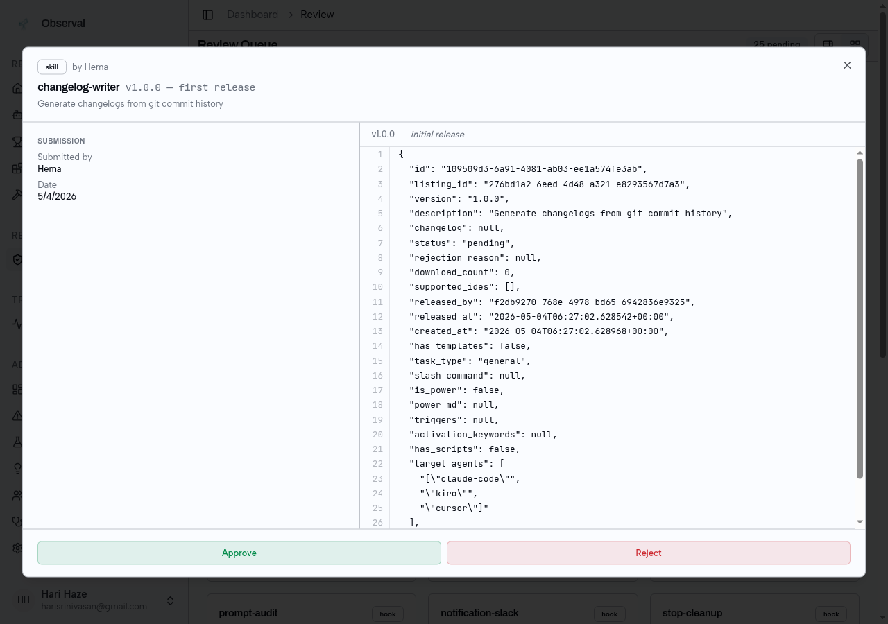

<!-- SPDX-FileCopyrightText: 2026 Apoorv Garg <apoorvgarg.21@gmail.com> -->
<!-- SPDX-FileCopyrightText: 2026 Hari Srinivasan <harisrini21@gmail.com> -->
<!-- SPDX-License-Identifier: AGPL-3.0-only -->

---
---

# Observal

*A self-hosted registry and observability platform for AI coding agents.*

Think Docker Hub, but for AI coding agents — publish, install, observe, and evaluate agent configurations across your team.

## What Observal does

1. **Agent Registry** — publish and install complete agent configurations. Each agent bundles its MCP servers, skills, hooks, prompts, and sandboxes into one portable YAML that works across Claude Code, Kiro, Cursor, Gemini CLI, and more.
2. **Telemetry Pipeline** — a transparent shim between your IDE and every MCP server. Every tool call becomes a span, spans group into traces, traces form sessions. Everything streams into ClickHouse with no changes to the MCP servers themselves.
3. **Evaluation & Scoring** — score agent sessions on goal completion, tool efficiency, factual grounding, and adversarial robustness. Compare agent versions side-by-side and track performance over time.
4. **Insight Reports** — AI-generated analysis of agent usage patterns including regression detection, cost breakdowns, cross-user comparisons, and actionable recommendations.
5. **Data Retention** — configurable per-organization retention policies with automatic purge scheduling, count-based limits, and dry-run previews before enabling.
6. **Role-Based Access Control** — four permission tiers (super_admin, admin, reviewer, user) with scoped access to registry, settings, and telemetry data.

## Who this is for

- **AI engineers** who want to know which agents deliver results, not just look good in a demo.
- **Platform teams** who need visibility, governance, and a single source of truth across agents.
- **Agent authors** who want to share their work and see how it performs on real workflows.
- **Self-hosters** who want the entire stack on their own infrastructure: Docker Compose up, no SaaS, no egress.

## Start here

| If you want to...                                     | Go to                                                   |
| ----------------------------------------------------- | ------------------------------------------------------- |
| Install the CLI and see your first trace in 5 minutes | [Quickstart](getting-started/quickstart.md)             |
| Understand traces, spans, agents, and components      | [Core Concepts](getting-started/core-concepts.md)       |
| Instrument the MCP servers you already use            | [Observe MCP traffic](use-cases/observe-mcp-traffic.md) |
| Run Observal on your own infrastructure               | [Self-Hosting](self-hosting/README.md)                  |
| Look up a specific CLI command                        | [CLI Reference](cli/README.md)                          |

## What it looks like

**Agent Registry** — browse, search, and install published agents

**Dashboard** — live agent scores, recent sessions, top downloads

**Trace Detail** — every tool call captured with models, token counts, and tool breakdown

**Insight Report** — AI-generated analysis of agent usage patterns

**Error Log** — classified errors with drill-through to the triggering session

**Review Queue** — admin approve/reject workflow for submitted components

## Supported IDEs

| IDE / Tool  | Support Level   | Features                                                              |
| ----------- | --------------- | --------------------------------------------------------------------- |
| Claude Code | Fully supported | Skills, hook bridge, MCP servers, rules, OTLP telemetry               |
| Kiro CLI    | Fully supported | Superpowers, hook bridge, MCP servers, steering files, OTLP telemetry |
| Gemini CLI  | Tested          | Hook bridge, MCP servers, rules, OTLP telemetry                       |
| Cursor      | Tested          | MCP servers, rules                                                    |
| VS Code     | Limited         | MCP servers, rules                                                    |
| Copilot CLI | Limited         | Hook bridge, MCP servers, rules                                       |
| Codex CLI   | Limited         | Rules                                                                 |
| OpenCode    | Limited         | Hook bridge (JS plugin), MCP servers, rules                           |

The full matrix is defined in `observal_cli/ide_registry.py`.

## Free & Open Source

Observal is open source under AGPL-3.0. The community edition includes the full registry, telemetry pipeline, evaluation engine, RBAC, and data retention — everything you need to run agents at scale, completely free.

## Enterprise Edition

For organizations that require compliance-grade infrastructure, the enterprise edition builds on top with SAML 2.0 SSO, SCIM 2.0 user provisioning, immutable audit logging with CSV export, and AI-powered insight reports with regression detection and cost analysis.

## Next

→ [Installation](getting-started/installation.md)
