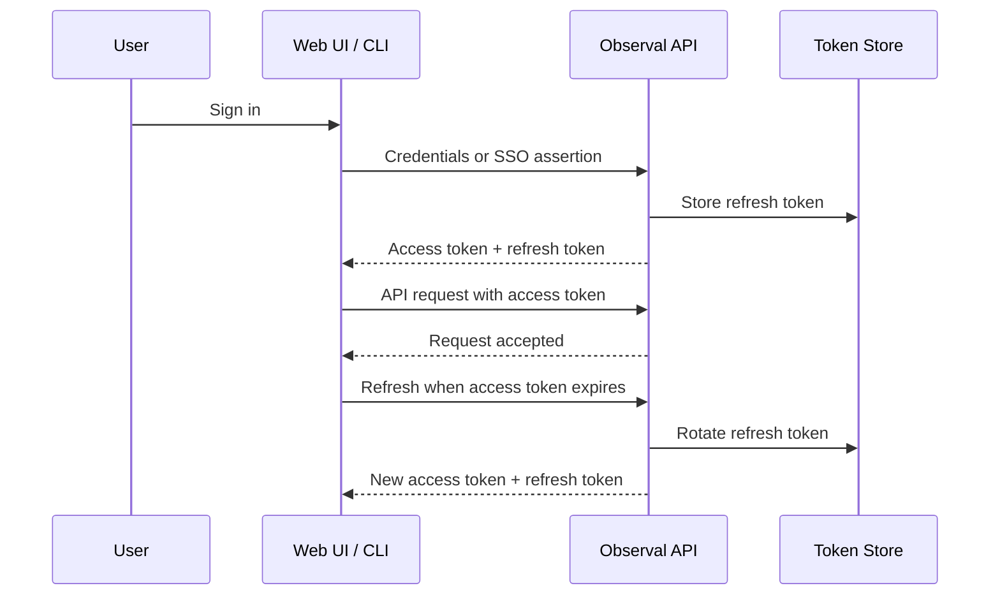

<!--
SPDX-FileCopyrightText: 2026 Vishnu Muthiah <vishnu.muthiah04@gmail.com>
SPDX-License-Identifier: AGPL-3.0-only
-->


# Token Expiry Settings

Most deployments don't need to change these. The defaults (60-minute access tokens, 30-day refresh tokens) work well for typical teams. Read on if you have compliance requirements, high-security needs, or users complaining about session behavior.

## Token Lifecycle



> **Tip:** Access tokens are verified without a database lookup (JWT signature only), making them fast but irrevocable. Refresh tokens are checked against the database, so revoking a refresh token immediately locks out the session.

## Recommended Configurations

Pick the row that matches your environment:

| Scenario | Access Token | Refresh Token | Refresh Mode | Hooks Token | Notes |
|----------|-------------|---------------|--------------|-------------|-------|
| **Development / local** | 60 min | 30 days | Sliding | 43200 min (30 days) | Defaults. Minimal re-auth friction. |
| **Production (standard)** | 30 min | 14 days | Absolute | 43200 min (30 days) | Good balance of security and UX. |
| **High-security / SOC 2** | 15 min | 24 hours | Absolute | 1440 min (1 day) | Short sessions, frequent re-auth. Set NTP sync. |
| **Shared workstations** | 15 min | 8 hours | Absolute | 480 min (8 hours) | Sessions don't survive shift changes. |
| **CI/CD service accounts** | 60 min | 90 days | Absolute | 43200 min (30 days) | Prefer API keys over tokens for CI. |

## How to Change

1. Go to **Settings > Security > Token Expiry** in the admin panel.
2. Adjust the values per the table above.
3. Save.

> **Warning:** Changing expiry does NOT retroactively affect existing tokens. Already-issued tokens keep their original TTL. To force all users to re-authenticate, use the "Revoke all sessions" action.

## Verify it works

Decode a freshly-issued access token to confirm the new expiry:

```bash
# Get a fresh token
observal auth token | cut -d. -f2 | base64 -d 2>/dev/null | python3 -m json.tool
```

Check the `exp` claim — it should be `iat` + your configured access token TTL (in seconds).


## General Guidance

- **Never set access tokens longer than refresh tokens.** The system enforces this, but attempting it produces a validation error.
- **Clock synchronization matters.** JWTs use `exp` / `iat` claims. If your server clock drifts >30 seconds from client clocks, tokens will be rejected prematurely or accepted past expiry. Use NTP.
