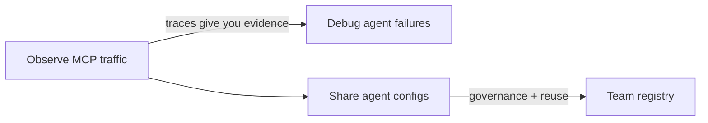

<!-- SPDX-FileCopyrightText: 2026 Apoorv Garg <apoorvgarg.21@gmail.com> -->
<!-- SPDX-License-Identifier: AGPL-3.0-only -->

# Use Cases

Observal solves five concrete problems in the AI-agent lifecycle. Each page below is written as a playbook: what the problem is, how Observal addresses it, and the exact commands to run.

| If you need to... | Read |
| --- | --- |
| See what your MCP servers are actually doing | [Observe MCP traffic](observe-mcp-traffic.md) |
| Package an agent once and ship it to any IDE | [Share agent configs across IDEs](share-agent-configs.md) |
| Figure out why a session went wrong | [Debug agent failures](debug-agent-failures.md) |
| Give your whole team a source of truth | [Run a team-wide agent registry](team-registry.md) |

## How these relate

You typically adopt Observal in that order: **observe** first (low-risk, instant value), then **debug**, then **share**, and finally **run a team registry** once you have enough published agents to justify governance.
